#  **Cisco WLC**

---

This page explains the configuration of the Cisco Wireless LAN Controller to work with IronWifi Captive Portal.

**Cisco WLC configuration**

Log in to the Cisco WLC Web-Browser interface and go to Advanced Settings.

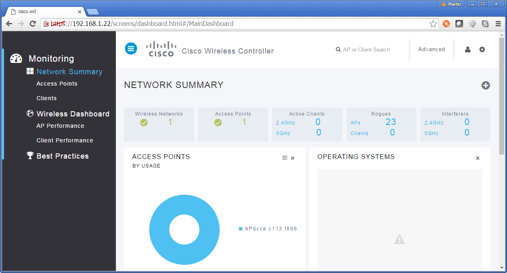

Go to **Security -> Access Control Lists** and add **two new ACL rules** permitting connections to the Captive Portal. Get the Captive Portal IP address from your Captive Portal settings -> Walled Garden -> IronWifi

- Source: Any, Destination: 107.178.250.42 netmask 255.255.255.255, protocol TCP, Dest port 443, Action: Permit
- Source 107.178.250.42 netmask 255.255.255.255, Destination: Any, protocol TCP, Source port 443, Action: Permit

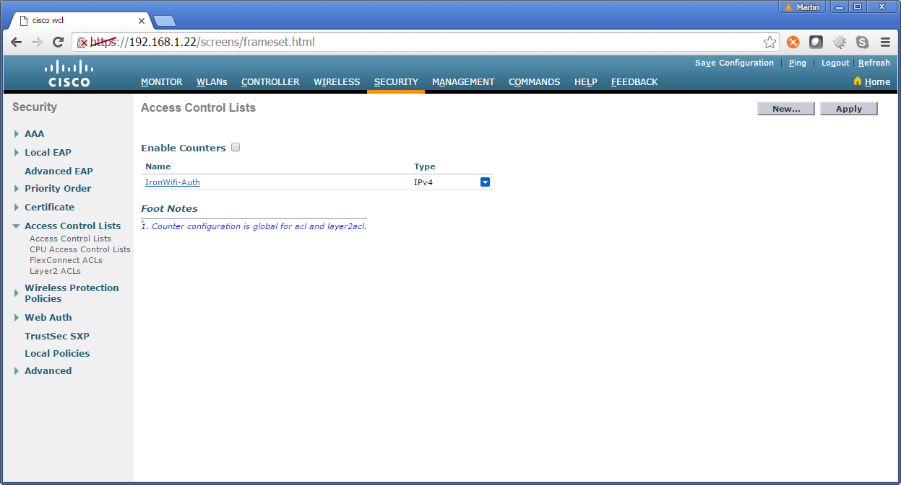

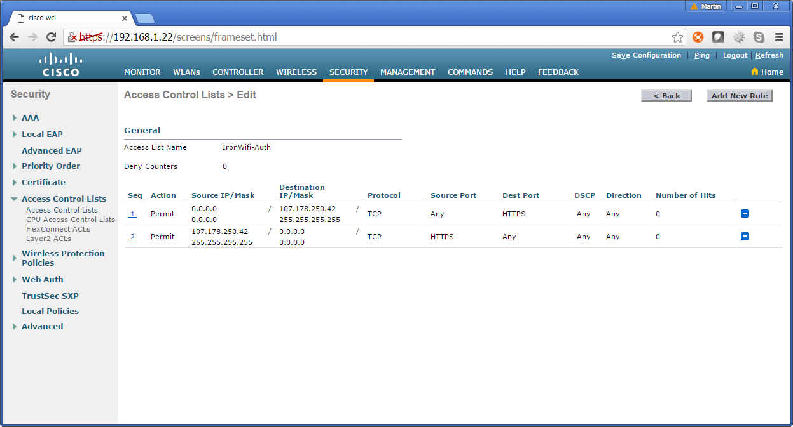

Go to **Security -> Web Auth -> Web Login Page** and change Web Authentication Type to **_External (redirect to an external server)_**. Add the External Webauth URL which is the Splash page URL from your Captive Portal in IronWifi Console

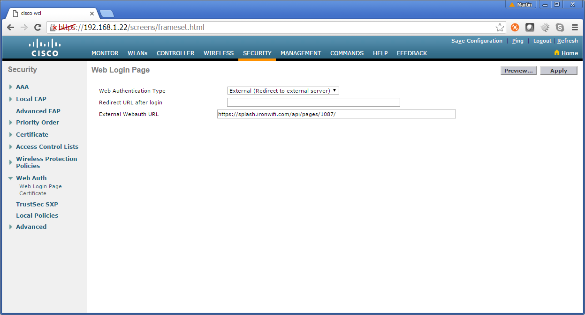

Go to **Security -> RADIUS -> Authentication**, add new RADIUS Authentication Servers and enter IP Address, Port and Shared Secret from your Captive Portal in IronWifi Console -> Controller Configuration -> RADIUS for the splash page

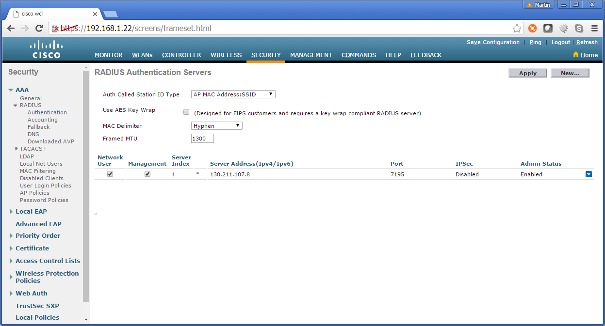

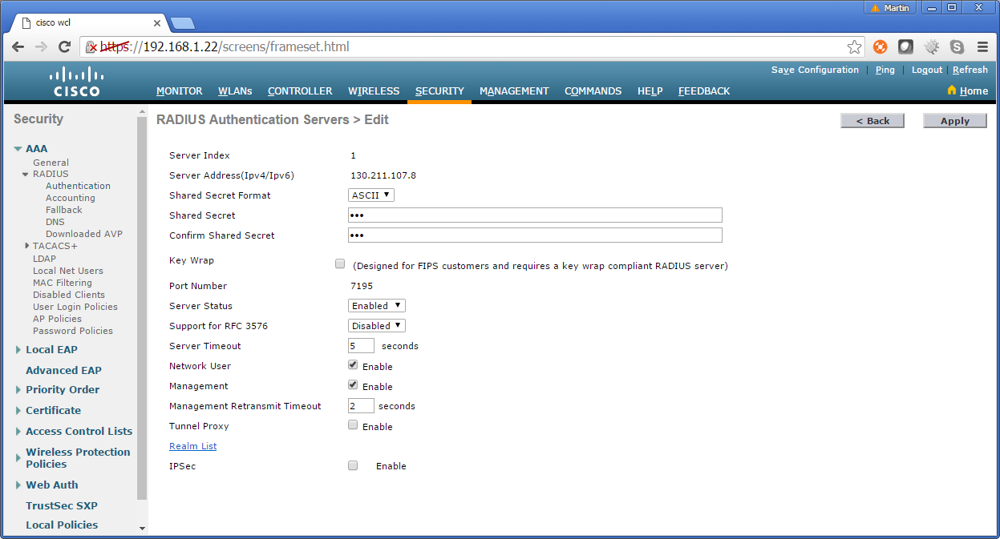

Go to **Security -> RADIUS -> Accounting**, add new RADIUS Accounting Servers and enter IP Address, Port and Shared Secret from your Captive Portal in IronWifi Console -> Controller Configuration -> RADIUS for the splash page

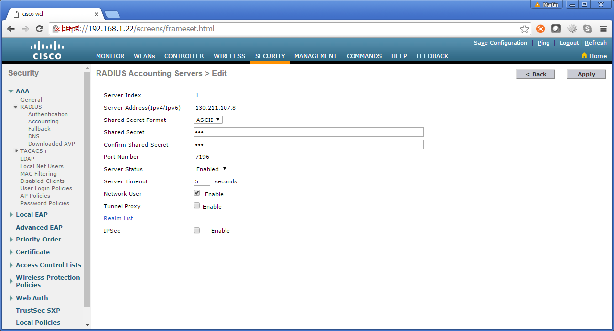

Go to **WLANs**, select existing or create new WLAN and open WLAN settings page

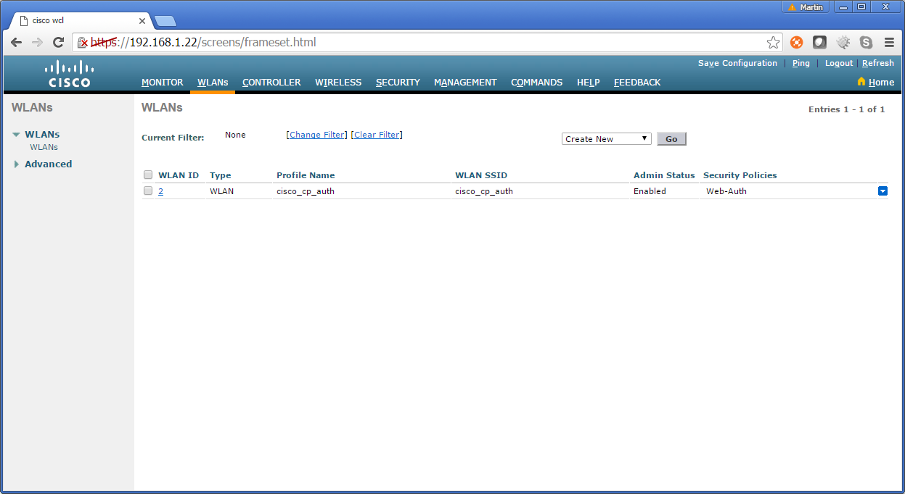

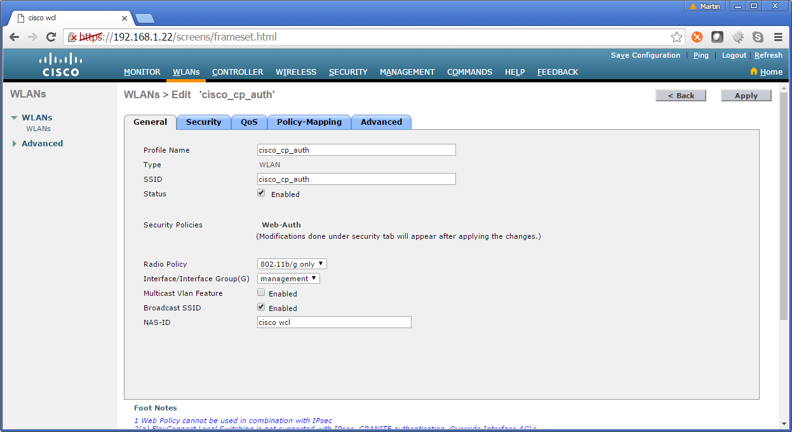

Click on the Security tab, Layer 2 and set **Layer 2 Security** to **_None_**

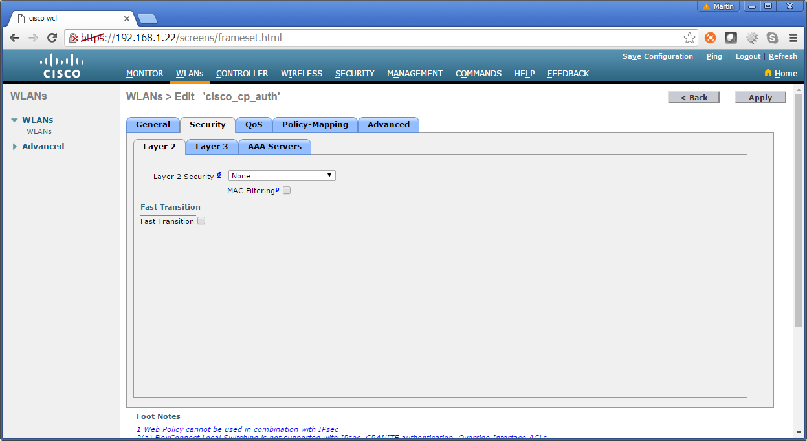

Click on the Layer 3 tab and set **Layer 3 Security** to **Web Policy**, select the **_Authentication_** radio button and select your new ACL for **Pre-authentication ACL**.

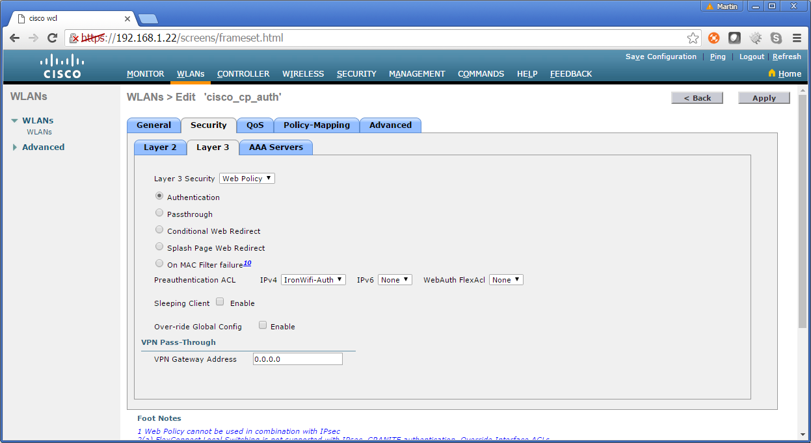

Click on the **AAA Servers** tab and select IronWifi RADIUS authentication and accounting servers. You can also set an **Interim Interval** to **_180_** seconds or higher.

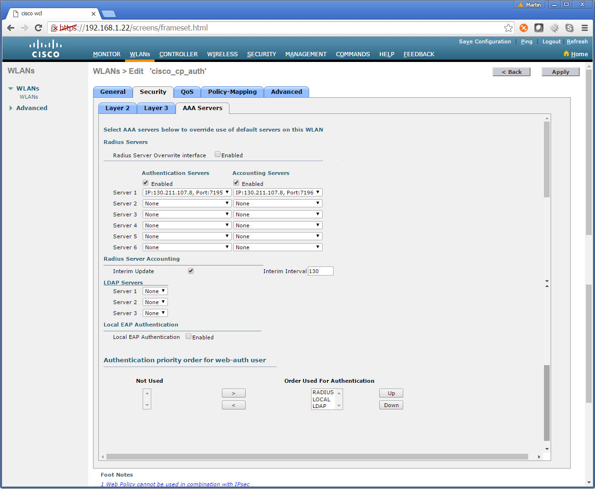

Click on the **Save Configuration** link to save and apply new settings.

Finally, install a valid SSL certificate on your controller to prevent warning messages displayed to your clients.

