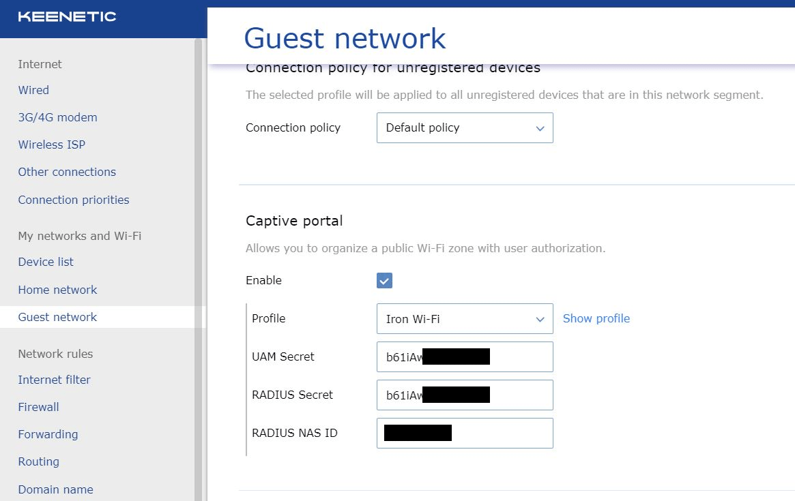
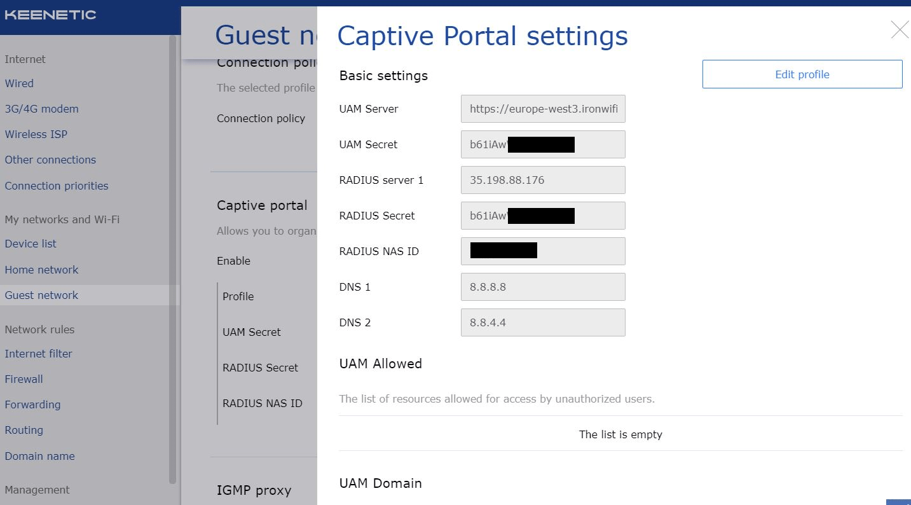

# Keenetic

This page explains the configuration of [Keenetic Access Points](https://keenetic.com) to work with IronWifi Captive Portal.

**IronWifi Console configuration**

1. Log in to the [IronWifi Console](https://console.ironwifi.com/)
2. From the menu, go to **Networks -> New Network** and define a new Network.
3. Go to **Captive Portals -> New Captive Portal**, fill in Name, select Network and select **_Keenetic_** as Vendor.
4. Click on Authentication Providers and add at least one [Authentication Provider](https://www.ironwifi.com/user-      guide/captive-portals/authentication-providers/) (start with Anonymous)
5. Scroll down to the **Controller Configuration** and copy the **Shared Secret** and **NAS ID**.

**Keenetic Access Point configuration**

1. Log in to the Keenetic AP Web-Browser interface and go to **Guest Network -> Captive Portal** settings

2. Update the settings - add RADIUS NAS ID, RADIUS Secret and UAM Secret (same as the RADIUS Secret). If you are using a different region than the europe-west3, update the Splash Page hostname and RADIUS server IP address accordingly.

