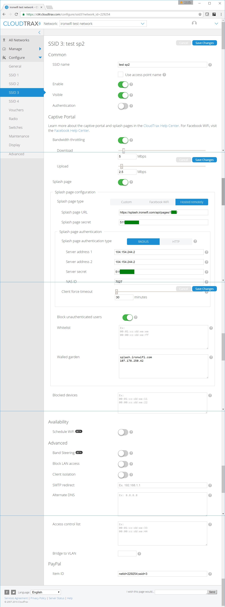

# Open-Mesh Cloudtrax

This page explains the configuration of Open-Mesh devices to work with IronWifi Captive Portal.

Open the configuration page of Cloudtrax and navigate as follows. Use RADIUS IP addresses, shared secret, and Splash page URL from IronWifi Console. NAS ID should be equal to the RADIUS authentication port.

