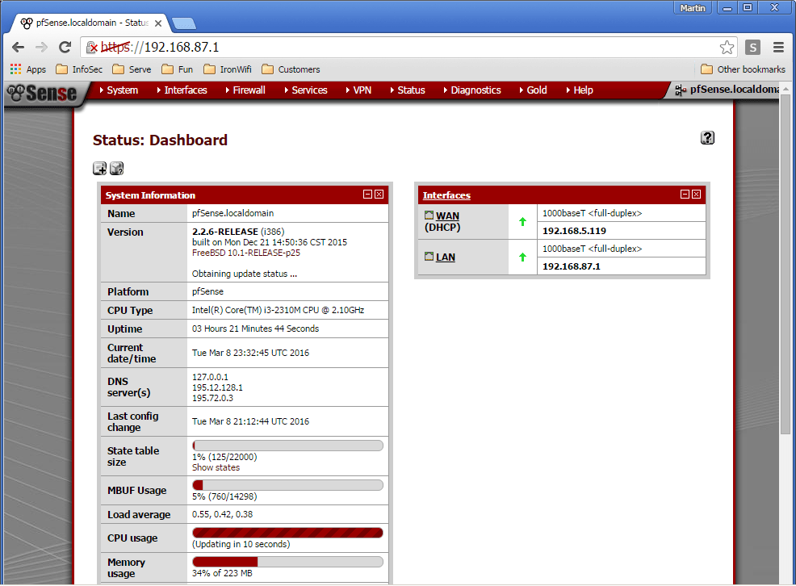
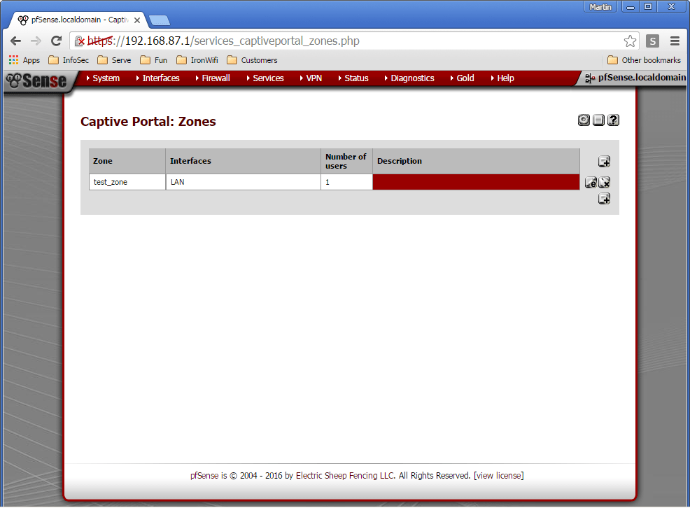

# pfSense with Captive Portal

This page explains different configuration scenarios for pfSense Firewall and authentication with IronWifi.

**IronWifi Console configuration**

1. Log in to the IronWifi Console
2. From the menu, go to Network -> Captive Portals -> New Captive Portal
3. Fill in Name, select Network, select pfSense as Vendor
4. Copy the Splash Page URL from Captive Portal settings page, e.g. https://us-east1.ironwifi.com/r-umj79-****-****/
5. Add at least one Authentication Provider

**pfSense Web GUI configuration**

Sign-in to the pfSense Firewall administration console.

Navigate to **Services -> Captive Portal** and add a new zone representing network that should be protected with a Captive Portal with RADIUS authentication - test_zone in our example.

Configure Zone, important parts are:

**Authentication** -> RADIUS Authentication (MSCHAPv2 works best)

**Primary Authentication Source** - RADIUS details from our Console -> Networks -> Captive Portals -> RADIUS for splash page

**Accounting** - enable and enter Accounting port if you wish to collect accounting information about your users including their current online status

**RADIUS options** - Reauthentication - enable if you wish to disconnect the user from our Console or via our REST API

**Portal Page Contents** - upload our Authentication page. You can download the page from Console -> Networks -> Captive Portals -> Controller Configuration -> Portal pages contents

Click on the **Save** button to apply new settings.

Click on Allowed IP addresses Tab and add IP addresses and networks that the user should be allowed to access before authentication. Typically, you will enter the IP addresses from the Walled garden that will include IP address of the External Captive Portal, Google, Facebook, LinkedIn, PayPal, SAML Identity Provider or any other Authentication Provider you select.

Please all IP addresses and hostname from IronWifi console

Click on the **Save** button to apply new settings.

## Optional: PfSense + OpenWrt - PfSense as shared captive provider

Go to Network → Interfaces and select the Lan interface.

Set an IP next to your main router on the field "IPv4 address". (If your main router has IP 192.168.1.1 set 192.168.1.2)

Then scroll down and select the checkbox "Ignore interface: Disable DHCP for this interface." - only if you like to have unlimited amount of clients, otherwise DHCP just assign only in defined radius

In the top menu go to System, then Startup, disable Firewall in the list of startup scripts.

Click the Save and Apply button. Hard-Restart your router if you're not able to connect anymore.

Now connect to the new IP you have just specified(192.168.1.2) and check if the settings for the LAN interface are the same you set before.

Verify that your LAN interface is up and online

Connect to your AP, if you had created and set-up pfSense splash page correctly (have created splash page, added at least one Authentication method, applied settings to pfSense), you should be able to login via captive splash page now if you try to access any website.

**Important: CONNECTION TO AP/ROUTER MUST BE IN THE LAN PORT!**

Link to original how-to: https://openwrt.org/docs/guide-user/network/wifi/dumbap

Also, here is a simple diagram how connection pfSense + OpenWRT works:

Simply written:

PC asks AP for internet, AP forwards it into pfSense, pfSense asks IronWifi if is valid or not, if not pfSense send captive page to PC, PC now must confirm that is valid via captive page, next time process ends in valid without need of captive page check.

