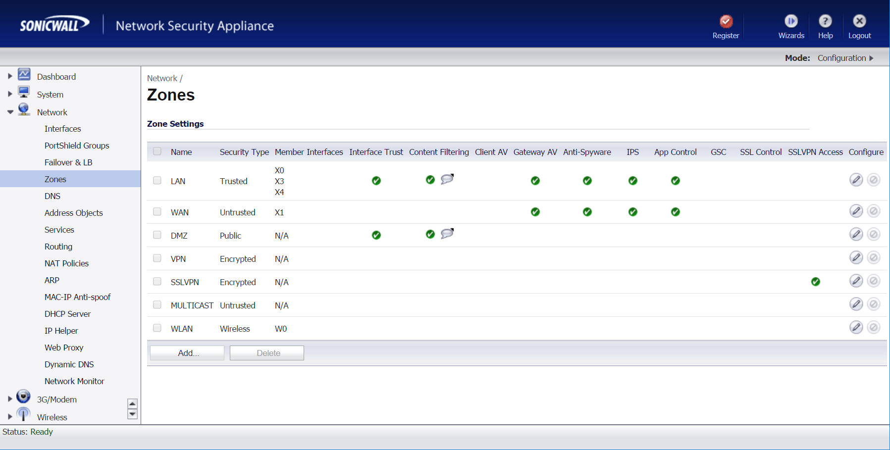

# SonicWall

This page explains the configuration of SonicWall devices to work with IronWifi Captive Portal.

### Assumptions

1. SonicWall Access Point is set up and running the latest firmware.
2. DHCP and DNS are appropriately configured.
3. IronWifi initial setup is complete. This setup includes Network and Captive Portal settings.
4. SonicWall Access Point can communicate with IronWifi servers.
5. The Guest SSID VLAN can communicate with IronWifi servers.
6. All systems are appropriately licensed.

### Instructions

Sign in to SonicWall Administration Interface. Click Network, click Zones and click the WLAN edit button.

