## Step 1: ironwifi.com configuration

### Login screen

We need to login into **console.ironwifi.com/login** system using our credentials. If you don't have a registered account then you need to create one. You can do that by clicking **Create Account**. 

### Create new network

In the opened browser window click **Networks**

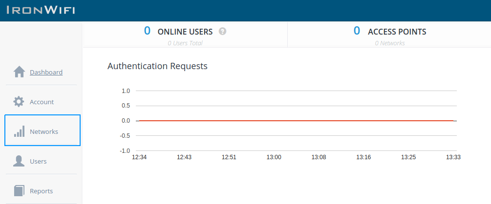

Click **New Network**

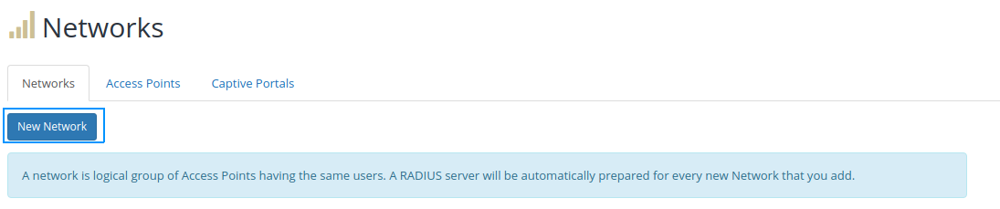

Type **name** of new network and select **region**

Click **Create network** 

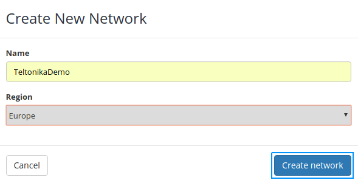

Click on your **created network** 

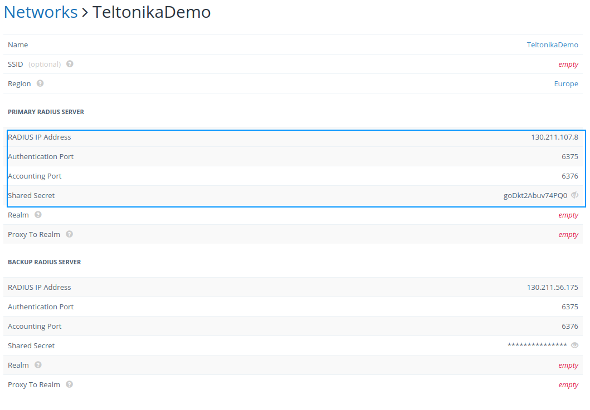

**Network details**

Here are the data that we will need in the next step:

**Radius ip Address** : 130.211.107.8

**Authentication Port** : 6375

**Accounting Port**  : 6376

**Shared Secret**  : goDkt2Abuv74PQ0 

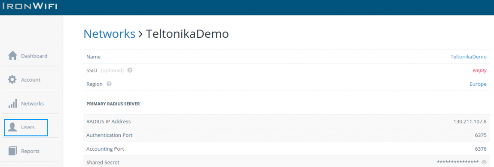

**Create new user**

Click **Users** 

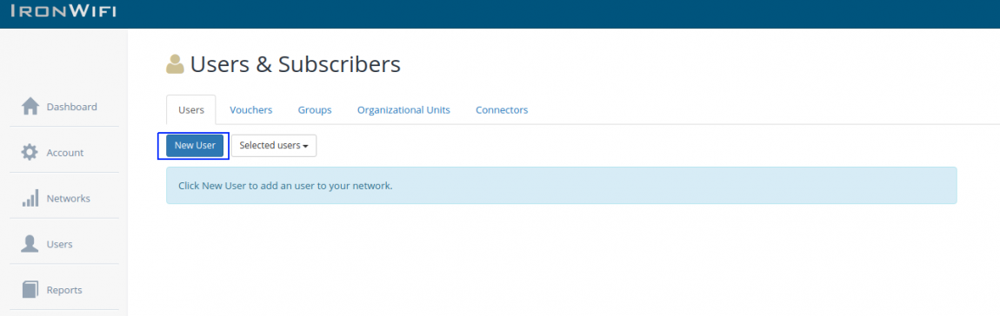

Click **New User** 

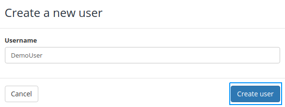

Type **Username** and click **Create User**

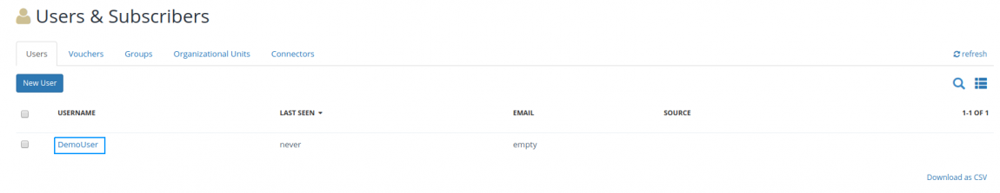

Click on your user 

Set new password and click **ENTER**

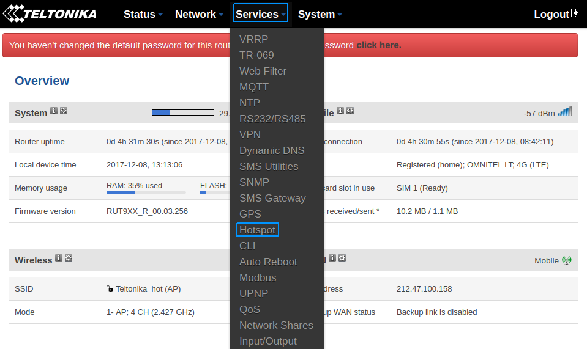

## Step 2: Router configuration

Now we need to open our RUT homepage. You can access the website by entering 192.168.1.1 in your internet browser's URL bar.

Open the hotspot configuration panel by clicking **Services → Hotspot** 

Click **Edit**

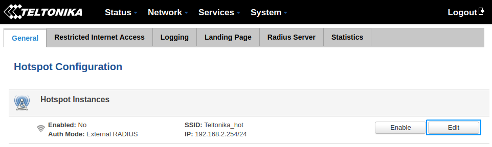

Use configuration details from **Step 1**.

Check **enable** and **Terms of service** box

Select **External radius** from **Authentication mode** dropbox

Type configuration details **RADIUS Server, Authentication port, Accounting port** and **Radius secret key**

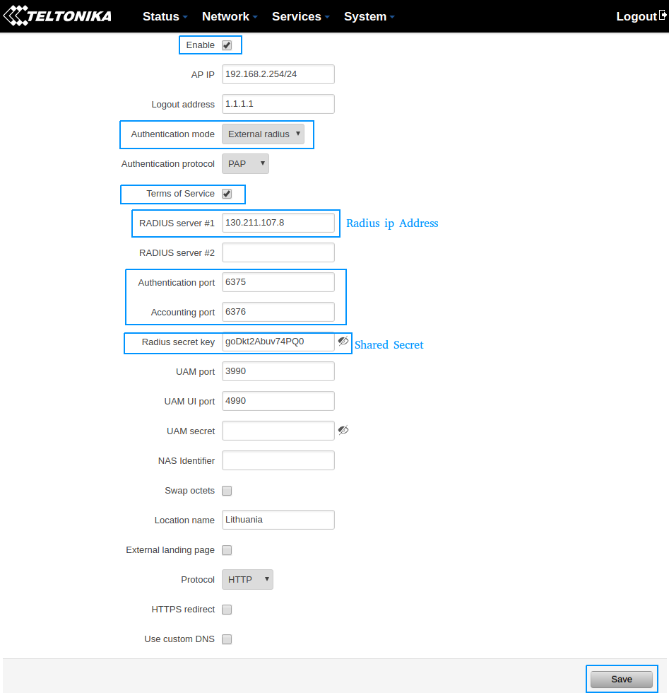

Click **save**

Wait up to **5** minutes from the time you saved the changes.

## Test your hotspot

Try connecting to your router using computer or mobile phone.

Select your router

Type your username and password.

Click **Login** 

You should see a message **Authorization Successful**

