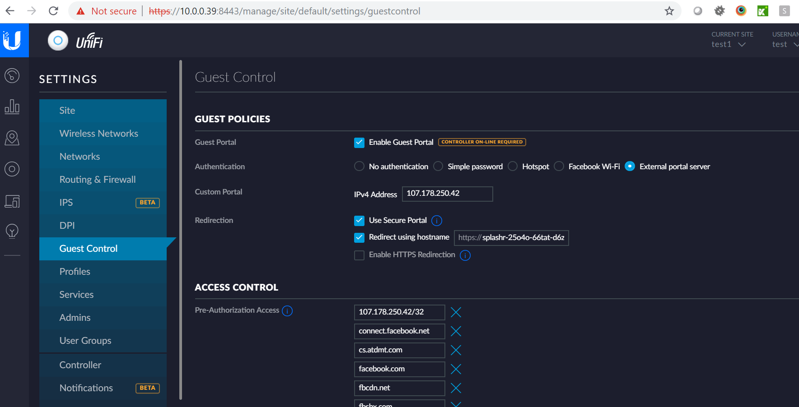

# Ubiquiti UniFi

This page explains different configuration scenarios for Ubiquiti UniFi Controller with IronWifi - Captive Portal and WPA-Enterprise with external RADIUS authentication and accounting.

Configuring UniFi Controller for external Captive Portal authentication

**IronWifi Console configuration**

1. Sign in to the [Management Console](https://console.ironwifi.com)
2. Click on Networks and add a Network
3. Click on Captive Portals and add a Captive Portal
4. In the Captive Portal settings, add Authentication Provider - can be Anonymous for testing purpose
5. IronWifi servers need direct access to your Controller (SW, Cloud Key) so we can authorize connecting devices. Enter the Controller URL or leave blank if the Controller public address is the same as connecting devices IP address (router public IP address). The controller URL should be in this format: - **https://your_public_static_ip:8443**. Make sure it is the PUBLIC IP address, and it's reachable through the Internet (not private address like 192.168.*.*, 172.16.*.*, or 10.*.*.*). You might need to configure port forwarding on your Internet router and firewall. If you are not sure, please consult with your ISP provider.
6. Decide if you want to enable the Use Proxy feature. If enabled, we will be connecting to your controller from static IP addresses 35.184.225.240, or 35.201.240.80, or 35.195.230.167, but the authorization process will be a little slower. If you disable this feature, we will be connecting from dynamic IP range - [https://cloud.google.com/appengine/kb/#static-ip](https://cloud.google.com/appengine/kb/#static-ip) and the client authorization process will be faster.
7. Enter Controller username (administrator privileges, you can create a new user in your controller) and password.
8. Enable Controller monitoring

**Ubiquiti Controller configuration**

1. Sign-in to your Ubiquiti Controller
2. In Wireless network settings change the Security to Open and enable Guest Services
3. Navigate to Guest services settings
4. Select External Captive Portal
5. Enter **107.178.250.42** in the IPv4 address input field
6. Check the Use Secure Portal checkbox
7. Check the **redirect using hostname** checkbox and enter the hostname from the Captive Portal settings page in IronWifi Console - for example, **splashr-bem7i-wud54-re5up.ironwifi.com**
8. Uncheck the Enable HTTPS Redirection
9. Add 107.178.250.42/32 to the Pre-Authorization Access list
10. Apply settings and try with your phone or computer

