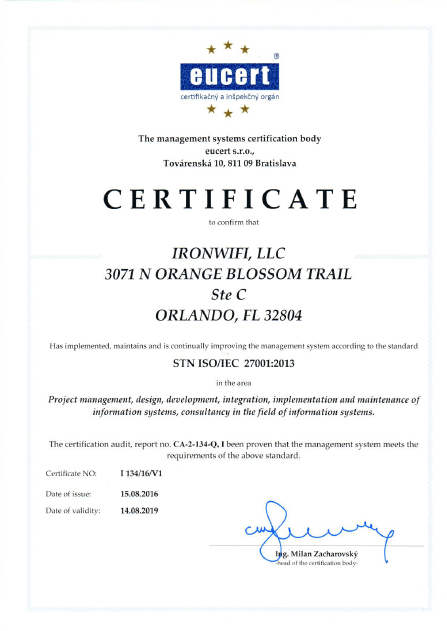
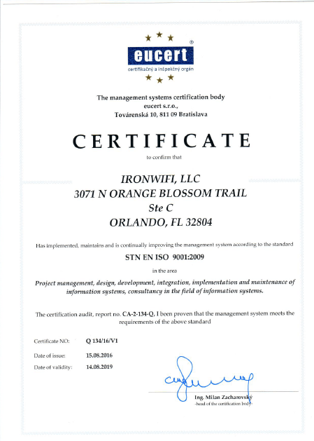

# Security and Compliance

## Disaster Recovery and Business Continuity

### DISASTER RECOVERY PLAN

IronWifi, as a SaaS application provider, developed and maintained a Disaster Recovery plan for its services. DR plan is validated for accuracy every six months.

### DISTRIBUTED DATA CENTER

The whole infrastructure is hosted in Google Cloud. Data centers are geographically dispersed around the world.

### Data Backup

All configuration and user data are backed up to Google Datastore. The backup data is distributed over many machines and using master-less synchronous replication over a wide geographic area.

### Certifications and Compliance

IronWifi has implemented, maintains, and is continually improving the management systems according to standards ISO 9001:2009 and ISO 27001:2013.

## Audit and Alert Capabilities

### INFRASTRUCTURE STATUS REPORTS

Infrastructure up-time / downtime is monitored using internal and external monitoring tools. Every information is logged and internally reported. We are not sharing this information with our customers.

### CHANGE/UPGRADE NOTIFICATIONS

Customers are notified about any software, hardware/data center change or upgrade if an impact is probable. This announcement is sent to the customers at least one week before the change or update.

### ADMIN AUDIT LOGS

All account administrator’s activities are logged for auditing purposes. The list of events can be provided to the customer when required.

### USER AUDIT LOGS

All user activity is logged and made available in the form of authentication and accounting reports.

### DATA ACCESS LOGS

All data access events are logged, and reports can be provided to the customer when required.

## Data Classification Capabilities

### DATA CLASSIFICATION CAPABILITY

The application allows classification of stored data in different security types – public (captive portal pages and shared files), confidential (configuration) and proprietary (source code)

Each classification is treated differently in terms of encryption and access control.

### DATA OWNERSHIP

The customer has the copyright and ownership of the content uploaded to our portal. Customer owns data they produce or upload to the platform.

### ACCOUNT CANCELLATION

If the customer decides to leave the service, all data associated with the customer is automatically erased after 30 days. Log data is erased after the retention period of 6 months.

### DOWNLOAD ON CANCELLATION

If the customer leaves the service, he is allowed to download the data. Data will be available for download after contacting the support personnel.

## Policy Enforcement and Access Control

### SUPPORT FOR A ROLE-BASED AUTHENTICATION/ACCESS

Application administrators can define multiple roles with different access permissions. These roles can be assign to team members. All roles are using the same authentication/access mechanisms.

### SUPPORT FOR MULTI-FACTOR AUTHENTICATION

The IronWifi platform does not require more than one authentication credential from the user.

### SSO / AD HOOKS

The application provides authentication via the OAuth protocol and optionally also via SAML 2.0. Other authentication protocols list OpenID, Facebook, Twitter, AD/LDAP, and LinkedIn are available only for Captive Portal users.

### GRANULAR ACTION BASED AUTHORIZATION POLICIES

An account administrator can add new members to the account. New members can have one of the following permissions assigned:

- Is Owner – can change account settings and manage team members
- Can edit – can change account settings
- Can read – can read all account settings and information

### SUPPORT FOR DEVICE TYPES

At this moment, we are no longer maintaining any native apps for iOS, Android, Windows Mobile, Blackberry or Desktop platform

### IP WHITE-LISTING

Customers are allowed to provide a set of IP addresses so that only those IP addresses will be allowed to use the application.

### ENFORCEABLE BEST PRACTICES FOR PASSWORDS

The application enforces best practices for passwords, requiring at least eight characters long passwords. The application does not define the frequency of change.

## Encryption

### DATA ENCRYPTION AT REST

The IronWifi console is using REST API, and all API calls are authorized with an OAuth access token. Data encryption is not enforced at the REST level.

### DATA ENCRYPTION IN TRANSIT

All information is protected using TLSv1.2 encryption algorithm during transfer (SSL).

### DATA MAINTAINED PER TENANT

The platform does not support encrypting customer data with a key managed and provided by the customer.

## File Sharing

The platform supports file sharing facility. Customers are allowed to upload and share their files via their Captive Portal.

### FILE SHARING CAPACITY

The platform does not allow anonymous sharing of data. A valid customer account and a credit card might be required to share a more massive amount of data.
