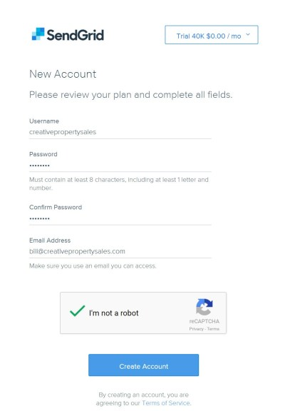
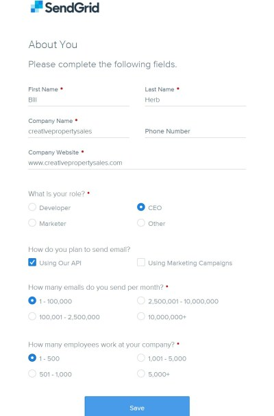
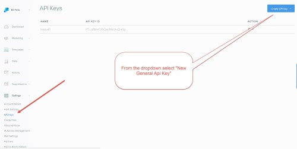
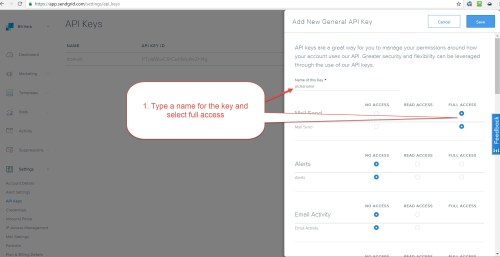
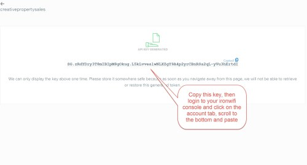
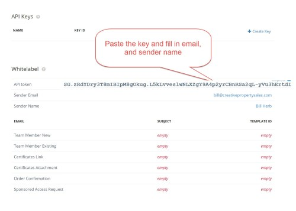
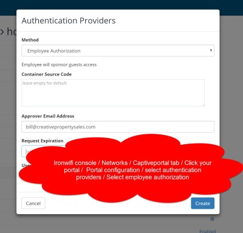
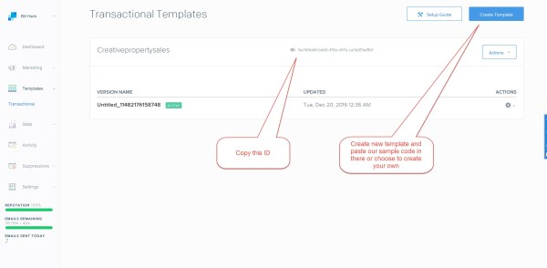
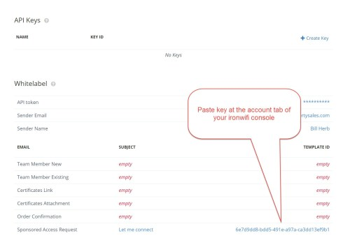

# SendGrid account setup

IronWifi is using SendGrid cloud service to deliver emails to its clients and users. As part of the [Whitelabel](https://www.ironwifi.com/user-guide/whitelabel/) feature, you are allowed to prepare your email templates to match your company brand and design.

This page describes the SendGrid registration process and instructions on how to configure your IronWifi account to work with your SendGrid account.

1. Signup for a SendGrid account https://sendgrid.com/pricing/

2.  Create a new general API key.

3. Paste API key into the IronWifi console/account tab.

4. Setup approval email address in IronWifi console (for Employee Authorization only)

5. From your SendGrid account create a **Legacy** template.

6. Paste the Id from SendGrid into the account tab of your IronWifi console, in the " sponsored access request " area.

