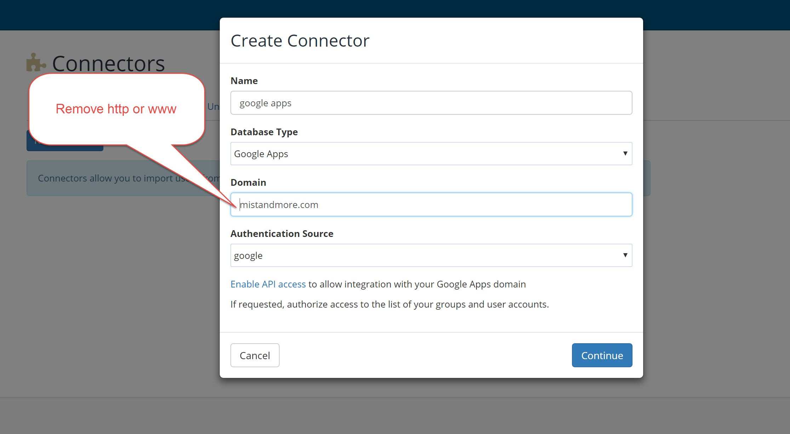

# Google Apps

If you want to manage your wireless users using Google Apps account, you can enable remote synchronization with your Google Apps account for users in specific groups and organizational units.

**How to enable Synchronization**

1. [Log in to the Console](https://console.ironwifi.com)
2. From the menu, go to **Users -> Connectors -> New Connector**
3. Fill in Name, select **_Google Apps_** as **Database Type**
4. Type your domain without the http: or www
5. Select Authentication Source:
   - **Google** - will forward authentication requests to Google servers for verification
   - **Local** will verify provided credentials locally - Cleartext-Password attribute, etc.
6. Configure your Google Apps account to allow API access by clicking the link below - [Enable API access](https://support.google.com/a/answer/60757?hl=en).
7. Click to Authorize, and you will receive a unique authorization code.

