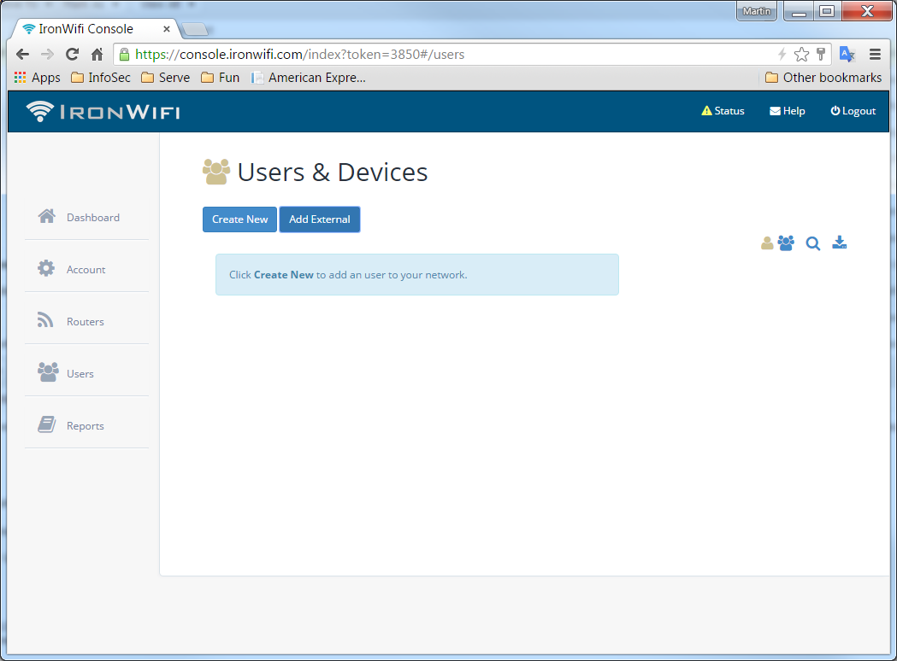
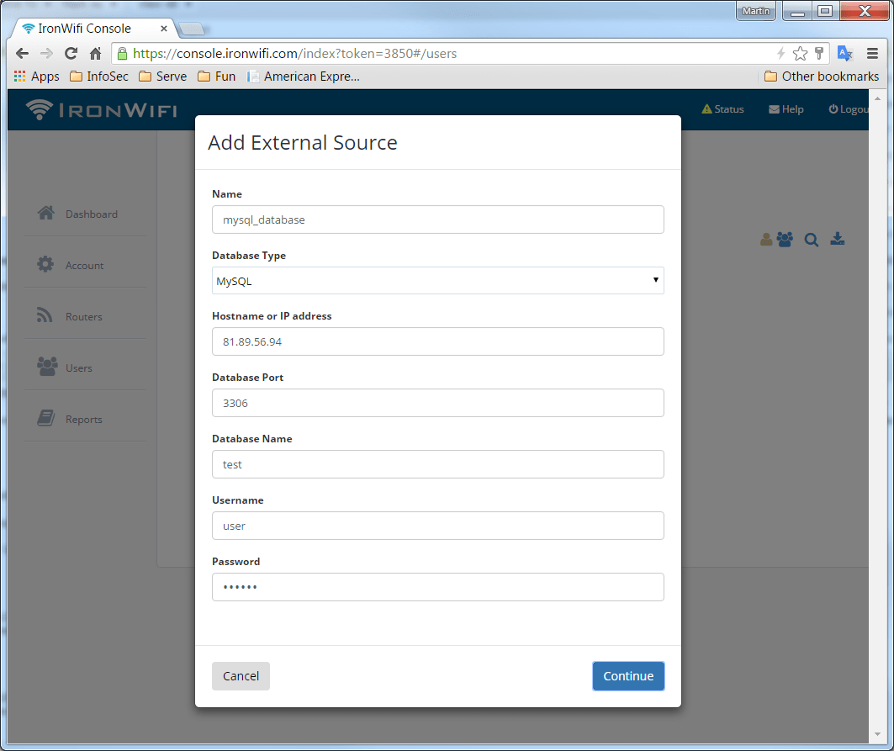
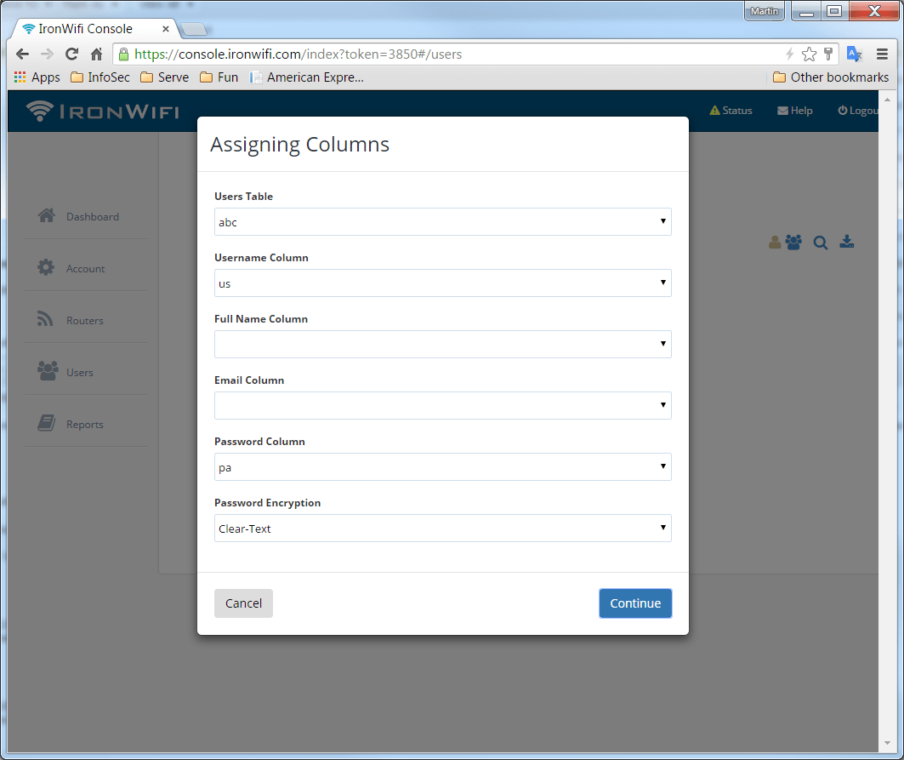
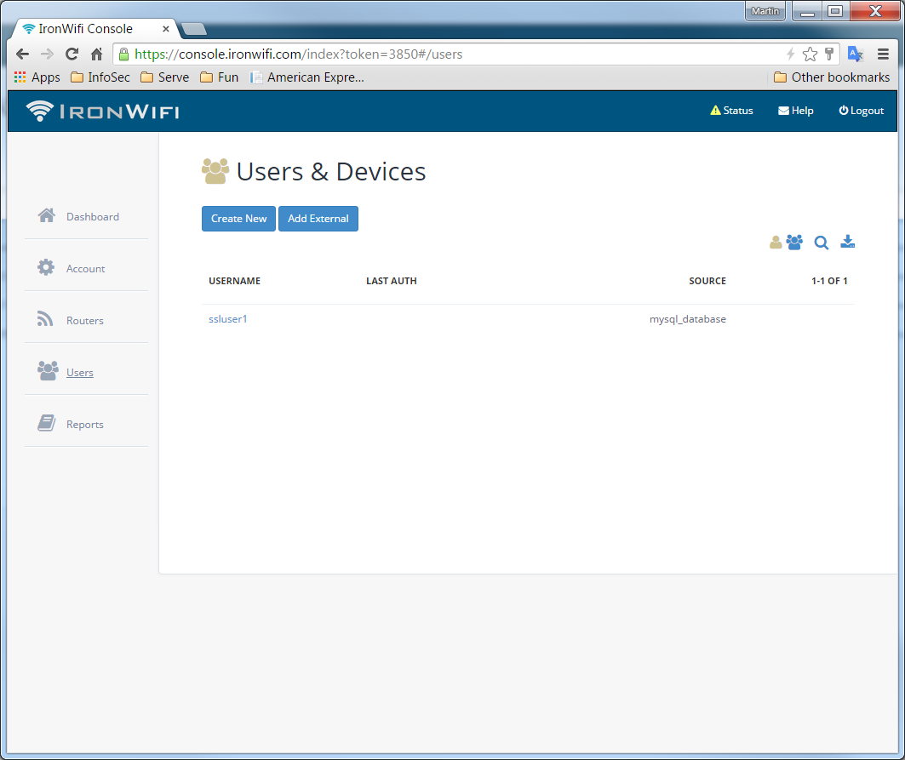
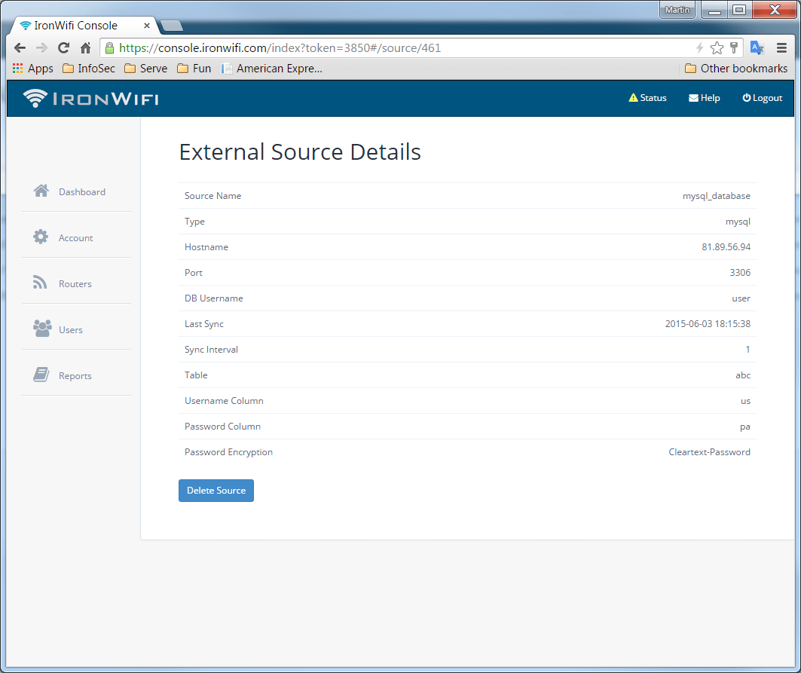

 # MySQL DB

This page describes how to add a MySQL database as an external source of users. We will import Users and synchronize data regularly.

**How to add MySQL as an external source**

 1. [Log in to the Console](https://console.ironwifi.com)
 2. From the menu, go to **Users -> Connectors -> New Connector**
 3. Fill in Name, select MySQL as **Database Type** and type in connection details. You can also use an SSL encrypted connection.
 4. Map table columns to user attributes
 5. Click Continue for the initial import
 

