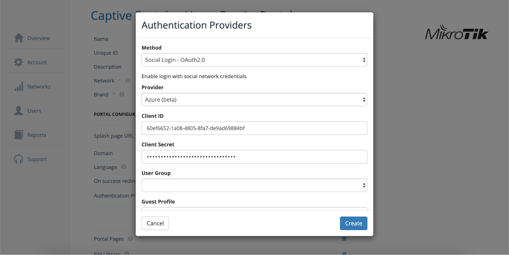

# Azure AD OAuth

This page provides instructions on how to configure your Azure Active Directory to allow Captive Portal authentication with OAuth.

1. Navigate to _https://portal.azure.com_
2. Go to Azure Active Directory submenu

