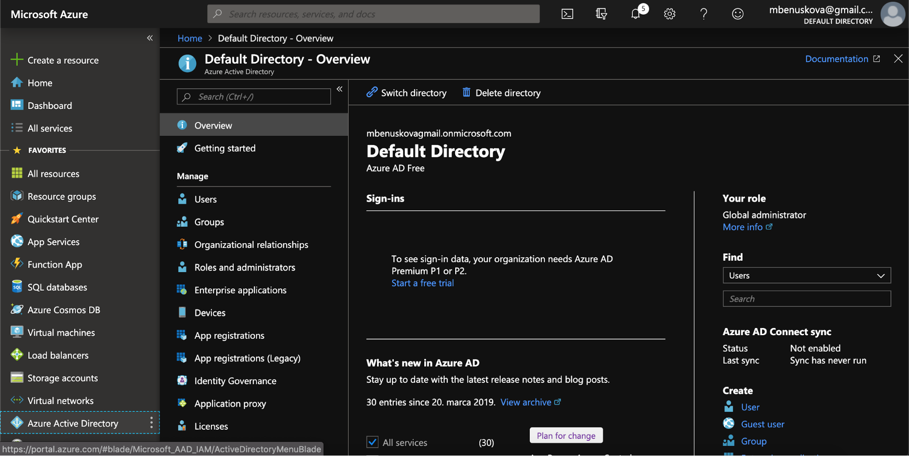
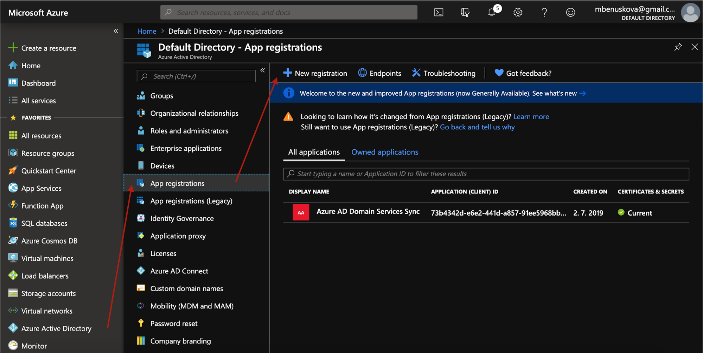
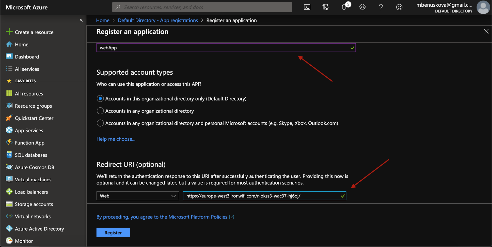
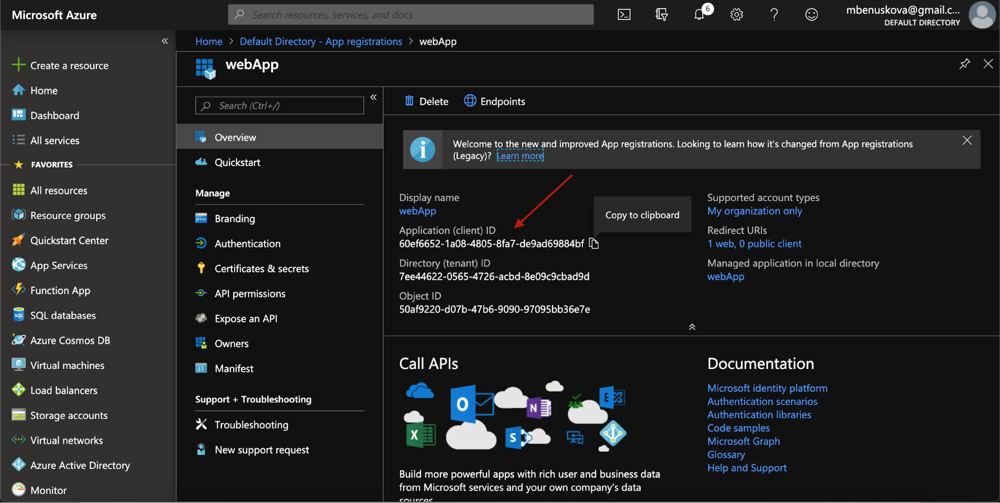
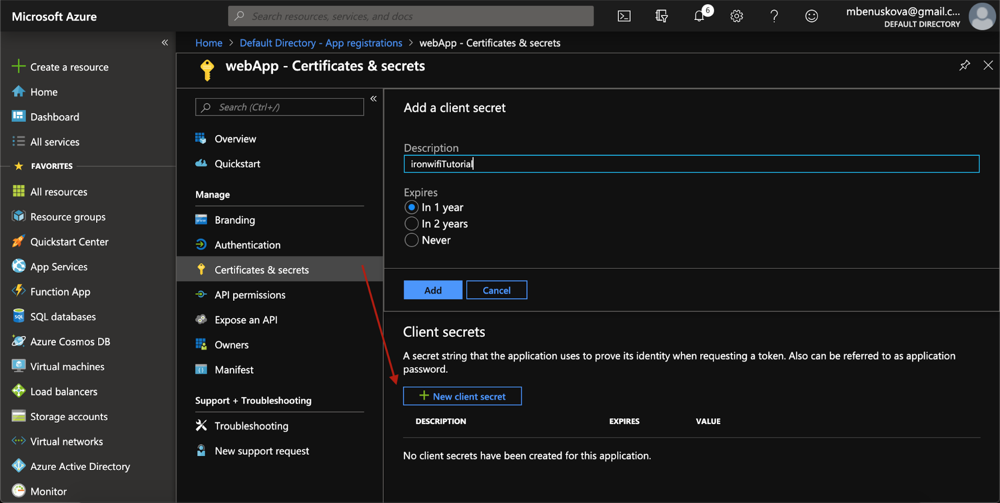
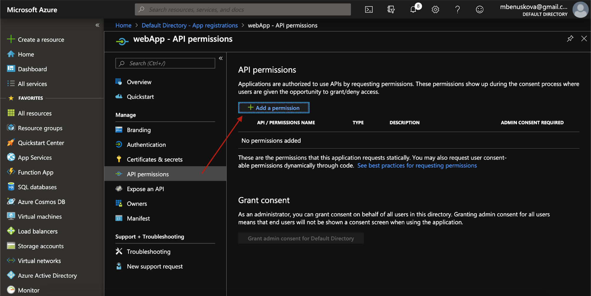
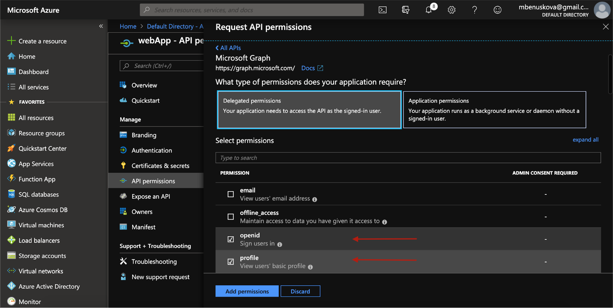
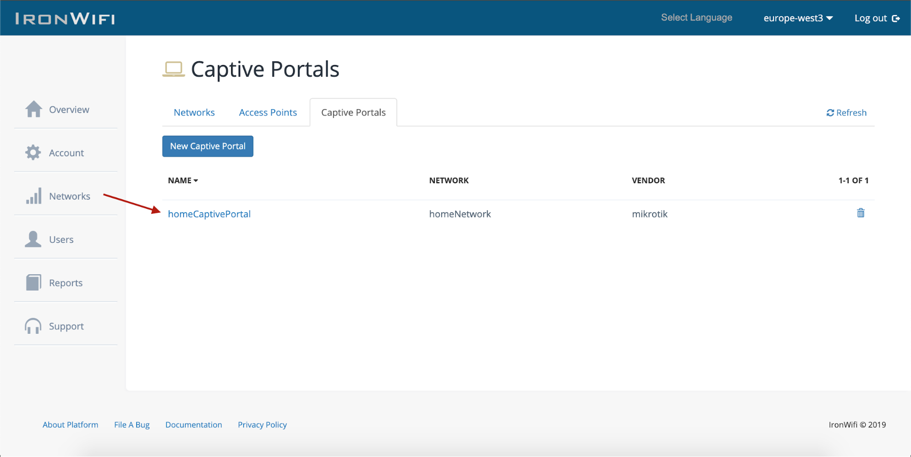
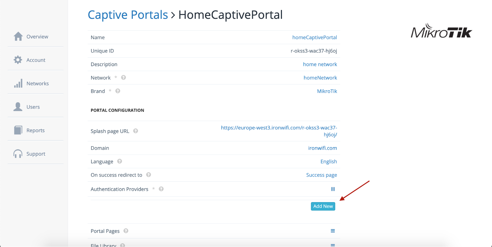

# Azure AD OAuth

This page provides instructions on how to configure your Azure Active Directory to allow Captive Portal authentication with OAuth.

1. Navigate to _https://portal.azure.com_
2. Go to Azure Active Directory submenu

3. Select the active directory you wish to use for SSO
4. Click on Application Registrations -> New application registration

5. Enter the name for the new application, type Web app / API, Sign-on URL enter - https://us-west1.ironwifi.com/api/signin/azure (update subdomain with the selected region or use splash for Global), then click **Register**

6. Copy Application-ID

7. In the application settings panel, click on **Certificates & secrets**, then add a new client secret and enter description and expiration time. Then simply click add.

8. Now copy the newly created Client Secret and navigate to **API permissions -> Add a permission -> Microsoft Graph -> Delegated permissions**

9. From there, enable access to **“Sign users in”** and **“View users’ basic profile”**. Then just click **Add permissions**.

## Sign in to IronWifi console

1. Click on **Networks -> Captive Portals** and create a new _Captive Portal_. Then click on the newly created Captive Portal

2. Expand the **Authentication Providers** menu and click **Add New**

3. Select **Social Login - OAuth 2.0**, provider **Azure**
4. Paste copied Application-ID (Client ID) and Secret Key (Client Secret), then click **create**

