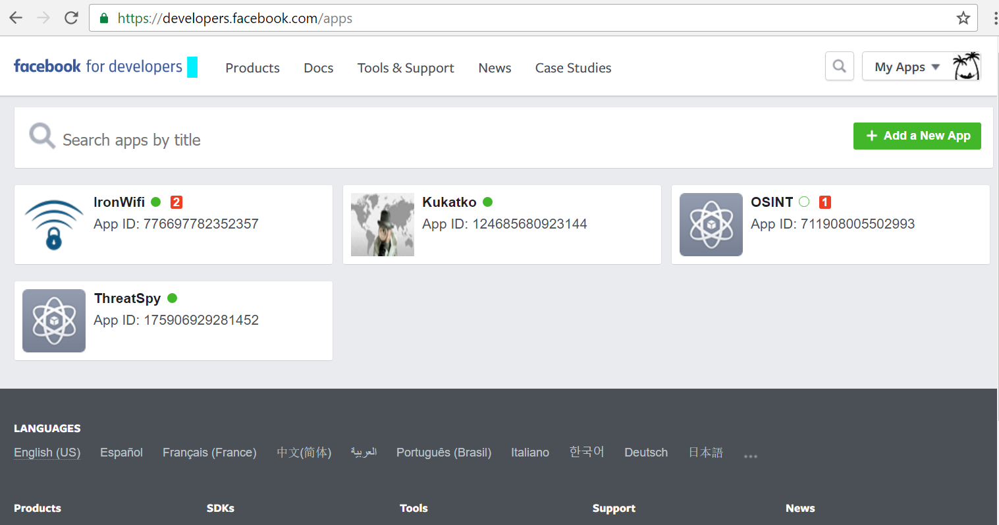
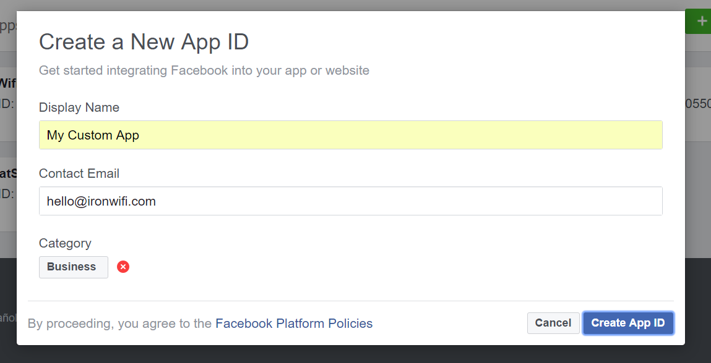
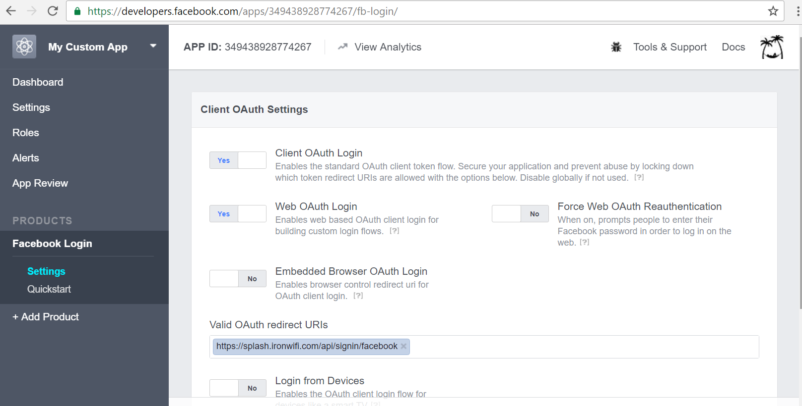
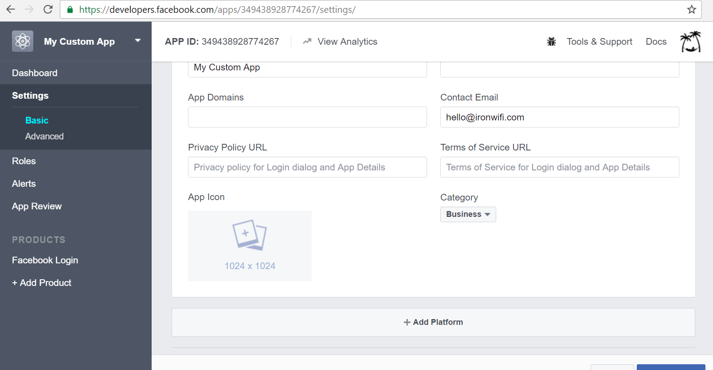
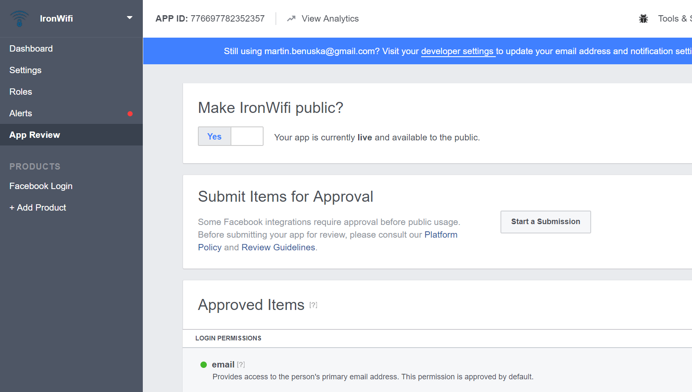
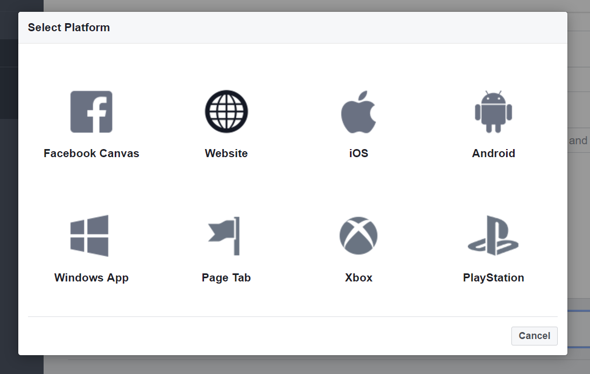
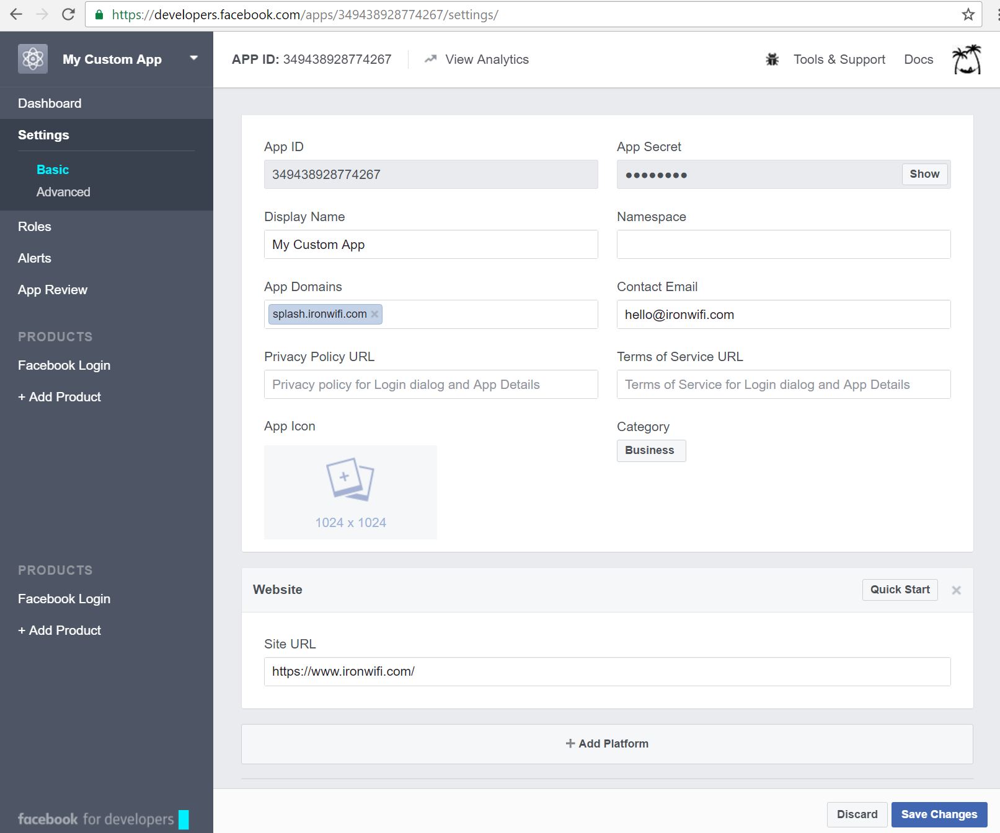
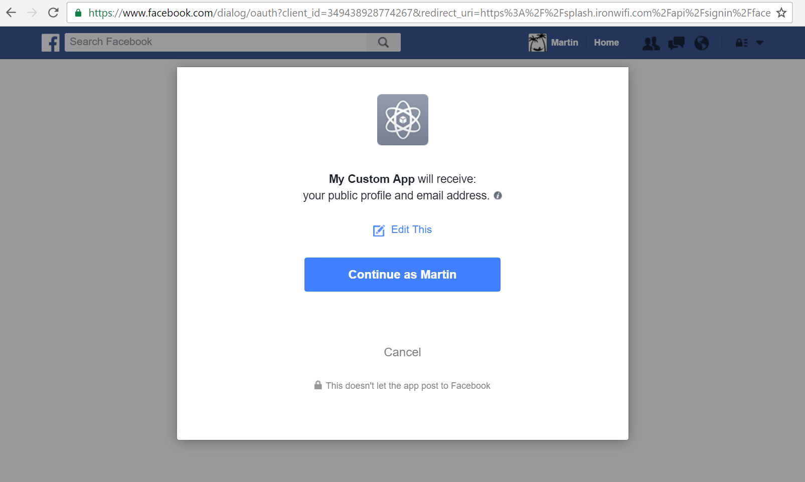

# Facebook

This page provides instructions on how to configure your Facebook App to allow Captive Portal authentication with OAuth 2.0.

Go to https://developers.facebook.com/apps and click the **Add a New App** button

Enter Application Name, Contact Email and select Category. Click Create App ID button.

An application dashboard will be displayed. On the bottom of the menu in the PRODUCTS section, click **Add Product** and add **Facebook Login**.

Open Facebook Login Settings page and enable **Client OAuth Login** and Web **OAuth Login**.

Now click on **Settings** under Dashboard to display Application settings page. Click **Add Platform** button on the bottom of the page.

Make sure the Application is live and available to public.

Click on the **Website** button.

Add _https://www.ironwifi.com_ to **Site URL** and _splash.ironwifi.com_ to **App Domains**.

Copy **App ID** and **App Secret** and add it to the Authentication Provider settings in [IronWifi Console](https://console.ironwifi.com).

Test Splash page authentication, authorize application access to the user profile. Optionally you can change the logo of your application to match your brand and styling.

Congratulation. Your guests can now use a Facebook account to authenticate on your Captive Portal.

