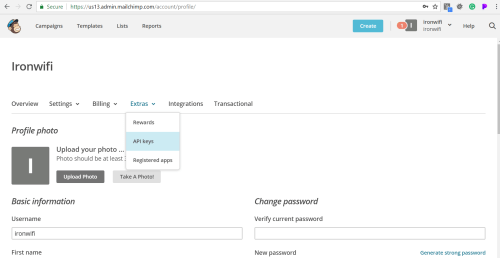
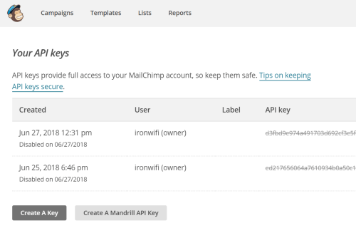
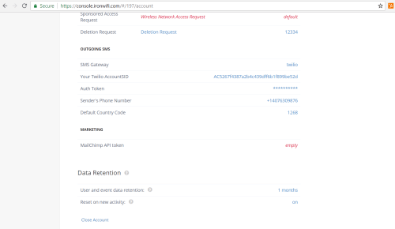
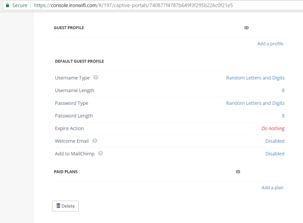
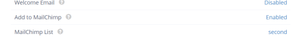
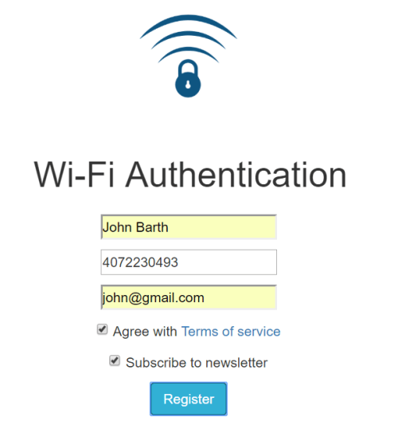
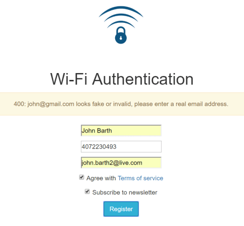
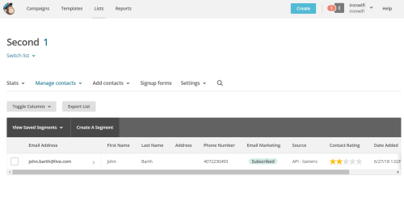

# MailChimp Integration

Sign in to your MailChimp account, go to your Profile, click on Extras and API keys.



Click on the Create A Key and copy generated API key.



Sign in to the IronWifi Console, go to Account -> White-label -> Marketing and add the MailChimp token.



Go to Captive Portal settings -> Guest Profile and enable the "Add to MailChimp" feature. Select the MailChimp list.





Test the guest registration process. To add users to your MailChimp list, include checkbox with the name "opt_in", or type "hidden" if you wish to sign up all guests.

```<input type="checkbox" name="opt_in" />```

or

```<input type="hidden" name="opt_in" value="on" />```



If an invalid or suspicious email address was entered, an error message will be displayed.



Member will be automatically added to the selected MailChimp list.




